# 아키텍처 및 설계

> **상위 문서**: [PRD.md](../PRD.md) | **v0.1 기획**: [v0.1_spec.md](./v0.1_spec.md)

---

## 1. 시스템 아키텍처

### Zed 환경 내 Extension 관계

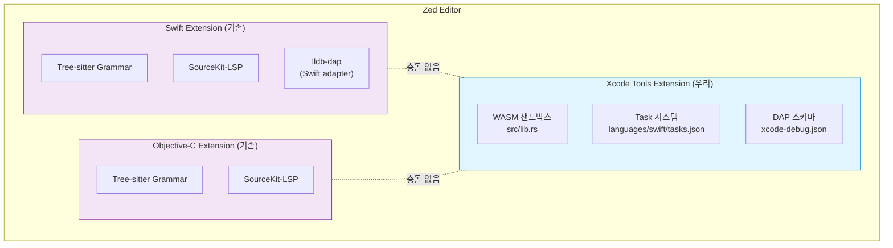

### Extension 내부 파일 구조

```
xcode-tools/
├── extension.toml                    # 매니페스트
├── Cargo.toml                        # Rust 의존성
├── LICENSE                           # Apache 2.0
├── src/
│   └── lib.rs                        # Extension trait + DAP
│                                     # v0.2: dap.rs 분리 예정
├── scripts/
│   └── helpers.sh                    # Task 공용 셸 함수 (번들)
├── languages/
│   └── swift/
│       ├── config.toml               # 언어 선언 (tasks.json 인식에 필요할 수 있음)
│       └── tasks.json                # Task 정의 (5개)
│                                     # v0.2: languages/objective-c/ 추가 검토
├── debug_adapter_schemas/
│   └── xcode-debug.json              # DAP 설정 스키마
└── README.md
```

---

## 2. 데이터 흐름

### 빌드 Task 흐름

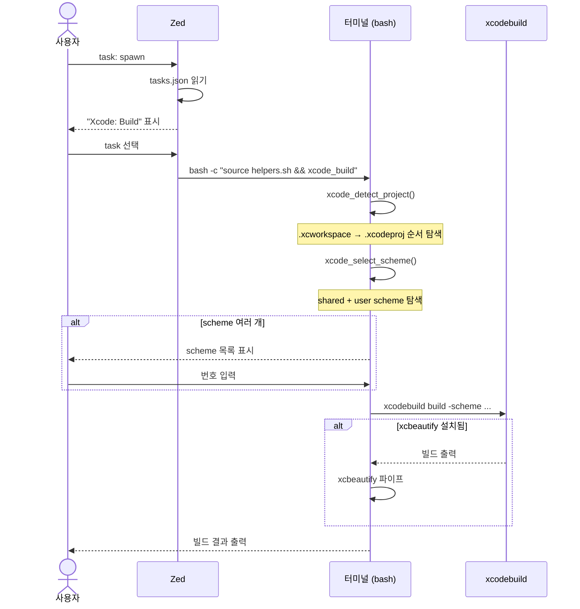

### DAP 디버깅 흐름

DAP(Debug Adapter Protocol)은 Zed가 디버거(lldb-dap)와 통신하는 규약이다.
우리 extension은 Zed에게 **"어떤 디버거를 어떻게 실행할지"** 알려주는 역할만 한다.

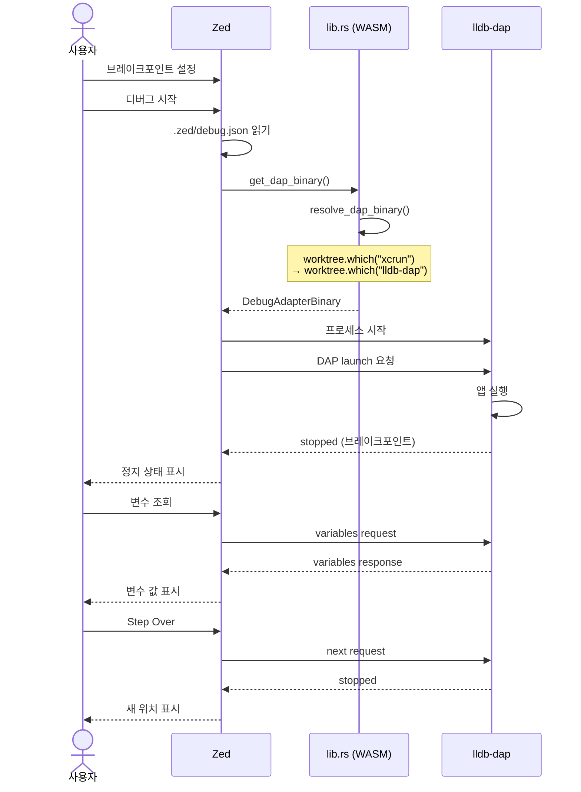

### Simulator 실행 Task 흐름

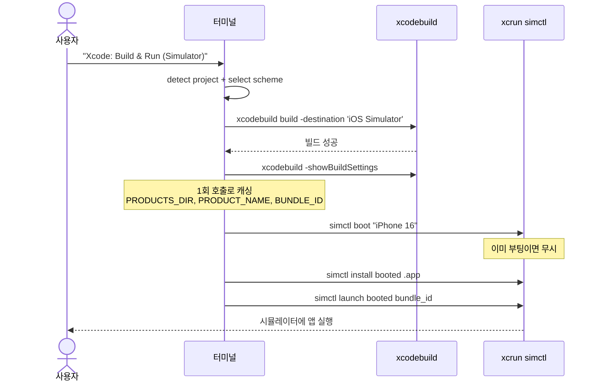

---

## 3. WASM Extension 설계 (src/lib.rs)

### DAP 타입 관계도

우리 extension이 다루는 Zed DAP 타입들의 관계:

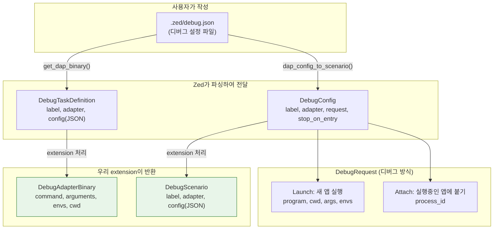

### 모듈 구조

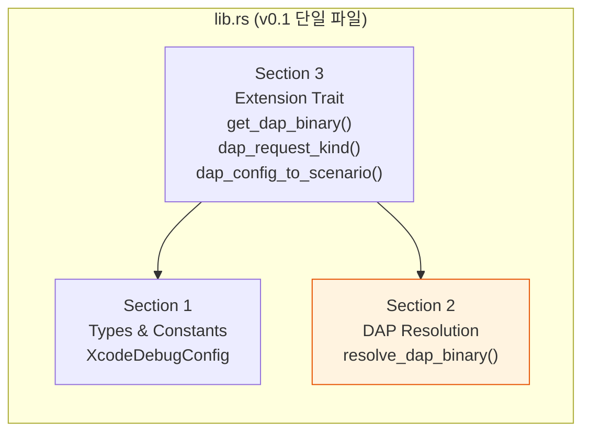

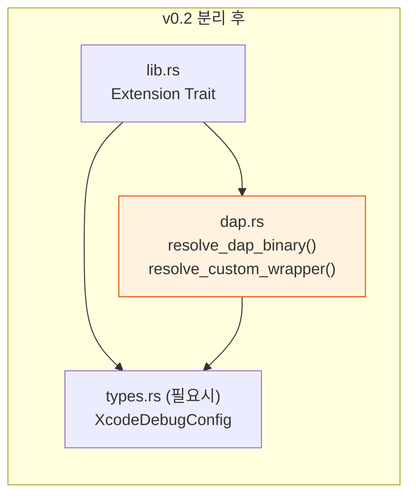

### DAP Fallback Chain

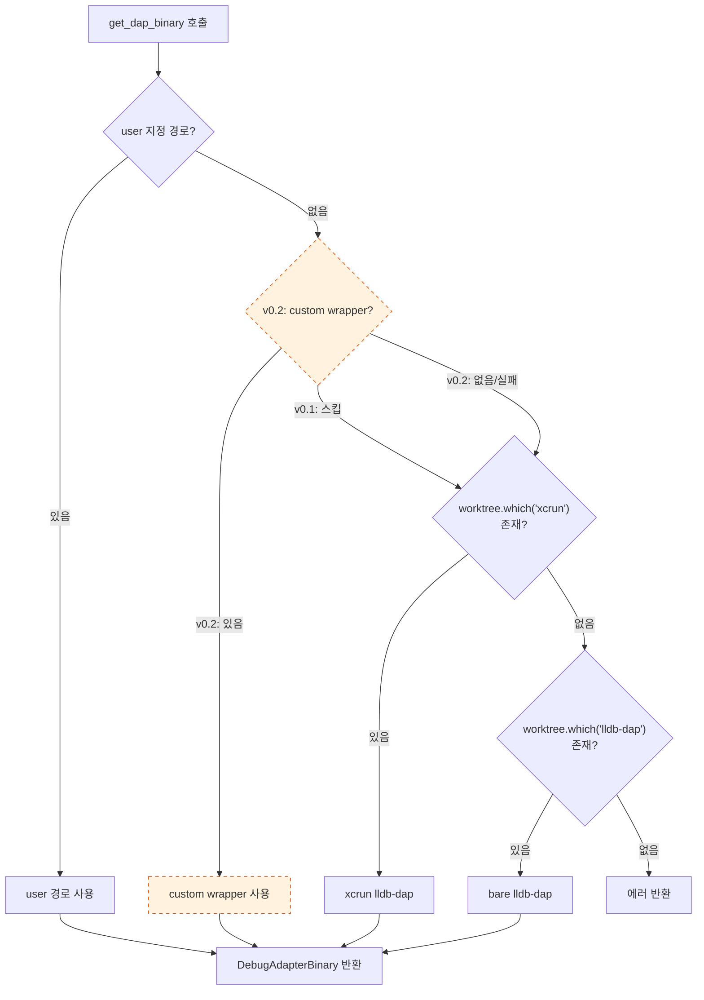

### 실제 API 기준 코드 구조

```rust
use zed_extension_api as zed;
use serde::{Deserialize, Serialize};
use std::collections::HashMap;

const ADAPTER_NAME: &str = "xcode-debug";

// ── 사용자 debug.json 설정을 파싱하는 구조체 ──
#[derive(Serialize, Deserialize)]
#[serde(rename_all = "camelCase")]
struct XcodeDebugConfig {
    request: String,                           // "launch" | "attach"
    #[serde(default)] program: Option<String>, // 실행 파일 경로
    #[serde(default)] cwd: Option<String>,     // 작업 디렉토리
    #[serde(default)] args: Vec<String>,       // 실행 인자
    #[serde(default)] env: HashMap<String, String>, // 환경 변수
    #[serde(default)] process_id: Option<u32>, // attach 대상 PID
    #[serde(default)] stop_on_entry: Option<bool>,
    // v0.2 확장: simulator_device, wait_for_debugger
}

struct XcodeToolsExtension;

impl zed::Extension for XcodeToolsExtension {
    fn new() -> Self { XcodeToolsExtension }

    // Zed가 디버그 세션 시작 시 호출: "어떤 디버거를 실행할지" 반환
    fn get_dap_binary(
        &mut self,
        adapter_name: String,
        config: zed::DebugTaskDefinition,   // .zed/debug.json 원본
        user_provided_debug_adapter_path: Option<String>,
        worktree: &zed::Worktree,
    ) -> Result<zed::DebugAdapterBinary, String> {
        if adapter_name != ADAPTER_NAME {
            return Err(format!("Unknown adapter: {adapter_name}"));
        }

        let parsed: XcodeDebugConfig = serde_json::from_str(&config.config)
            .map_err(|e| format!("Config parse error: {e}"))?;

        let request = match parsed.request.as_str() {
            "launch" => zed::StartDebuggingRequestArgumentsRequest::Launch,
            "attach" => zed::StartDebuggingRequestArgumentsRequest::Attach,
            _ => return Err(format!("Invalid request: {}", parsed.request)),
        };

        // lldb-dap 바이너리 탐색 (worktree.which() 사용)
        let (command, arguments) = resolve_dap_binary(
            user_provided_debug_adapter_path, worktree
        )?;

        Ok(zed::DebugAdapterBinary {
            command: Some(command),
            arguments,
            envs: vec![],
            cwd: Some(parsed.cwd.unwrap_or_else(|| worktree.root_path())),
            connection: None,
            request_args: zed::StartDebuggingRequestArguments {
                configuration: config.config,
                request,
            },
        })
    }

    // config JSON에서 launch/attach 판별
    fn dap_request_kind(
        &mut self,
        _adapter_name: String,
        config: serde_json::Value,
    ) -> Result<zed::StartDebuggingRequestArgumentsRequest, String> {
        match config.get("request").and_then(|v| v.as_str()) {
            Some("launch") => Ok(zed::StartDebuggingRequestArgumentsRequest::Launch),
            Some("attach") => Ok(zed::StartDebuggingRequestArgumentsRequest::Attach),
            Some(other) => Err(format!("Unknown request: {other}")),
            None => Err("Missing 'request' field".to_string()),
        }
    }

    // Zed 내부 DebugConfig → 우리 adapter용 DebugScenario 변환
    fn dap_config_to_scenario(
        &mut self,
        config: zed::DebugConfig,   // ← DebugConfig { request: DebugRequest, ... }
    ) -> Result<zed::DebugScenario, String> {
        let debug_config = match &config.request {
            zed::DebugRequest::Launch(launch) => XcodeDebugConfig {
                request: "launch".to_string(),
                program: Some(launch.program.clone()),
                cwd: launch.cwd.clone(),
                args: launch.args.clone(),
                env: launch.envs.iter().cloned().collect(),
                process_id: None,
                stop_on_entry: config.stop_on_entry,
            },
            zed::DebugRequest::Attach(attach) => XcodeDebugConfig {
                request: "attach".to_string(),
                program: None,
                cwd: None,
                args: vec![],
                env: HashMap::new(),
                process_id: attach.process_id,
                stop_on_entry: None,
            },
        };

        Ok(zed::DebugScenario {
            label: config.label,
            adapter: ADAPTER_NAME.to_string(),
            build: None,
            config: serde_json::to_string(&debug_config)
                .map_err(|e| format!("Serialize error: {e}"))?,
            tcp_connection: None,
        })
    }
}

// lldb-dap 바이너리 탐색 (worktree.which() API 사용)
fn resolve_dap_binary(
    user_path: Option<String>,
    worktree: &zed::Worktree,
) -> Result<(String, Vec<String>), String> {
    // 1. 사용자 지정 경로
    if let Some(path) = user_path {
        return Ok((path, vec![]));
    }
    // 2. xcrun lldb-dap (Xcode 내장, 가장 안정적)
    if worktree.which("xcrun".to_string()).is_some() {
        return Ok(("xcrun".to_string(), vec!["lldb-dap".to_string()]));
    }
    // 3. bare lldb-dap
    if let Some(path) = worktree.which("lldb-dap".to_string()) {
        return Ok((path, vec![]));
    }
    Err("lldb-dap not found. Install Xcode or set debug adapter path.".to_string())
}

zed::register_extension!(XcodeToolsExtension);
```

### 설계 원칙

| 원칙 | 적용 |
|------|------|
| `#[serde(default)]` 전 필드 | 새 필드 추가 시 기존 config 하위 호환 |
| `resolve_dap_binary()` 독립 함수 | v0.2 모듈 분리 시 변경 최소화 |
| `worktree.which()` 사용 | Zed 공식 API로 바이너리 탐색 (커스텀 함수 불필요) |
| eval 미사용, `"$@"` 사용 | 셸 인젝션 방지 |

---

## 4. Task 셸 스크립트 설계

### 번들 방식 — helpers.sh를 extension에 포함

Extension 설치 시 `scripts/helpers.sh`가 함께 배포된다.
각 task는 이 파일을 직접 source하여 사용한다.

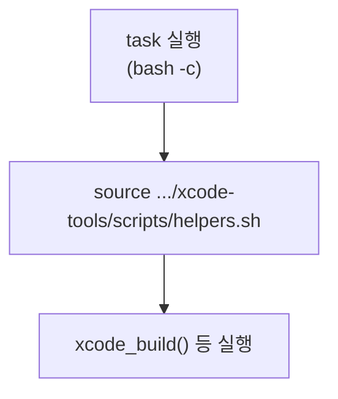

**설치된 extension 경로** (macOS):
```
~/Library/Application Support/Zed/extensions/installed/xcode-tools/
```

**tasks.json 내 각 task 구조**:
```json
{
  "label": "Xcode: Build",
  "command": "bash",
  "args": [
    "-c",
    "source \"$HOME/Library/Application Support/Zed/extensions/installed/xcode-tools/scripts/helpers.sh\" && xcode_build"
  ]
}
```

> **Dev Extension 주의**: 개발 중 "Install Dev Extension"으로 설치하면 경로가 다를 수 있음.
> S1-2 Spike에서 dev/production 경로 차이를 검증하고, 필요 시 fallback 경로 추가.

### helpers.sh 함수 관계

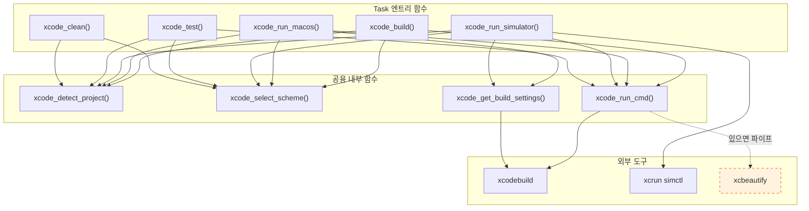

### helpers.sh 핵심 함수

```bash
# ── 설정 (환경변수 → v0.2에서 settings.json 확장) ──
XCODE_TOOLS_SIMULATOR="${XCODE_TOOLS_SIMULATOR:-iPhone 16}"
XCODE_TOOLS_CONFIG="${XCODE_TOOLS_CONFIG:-Debug}"

# ── 프로젝트 감지 ──
xcode_detect_project() {
    # .xcworkspace 탐색 (maxdepth 1, .xcodeproj 내부 제외)
    # → 없으면 .xcodeproj 탐색 (maxdepth 2)
    # → 출력: "-workspace X" 또는 "-project X"
}

# ── Scheme 탐색 (shared + user 모두) ──
xcode_select_scheme() {
    # xcshareddata/xcschemes/ + xcuserdata/*/xcschemes/ 모두 탐색
    # 중복 제거 + 정렬
    # 1개 → 자동, 여러 개 → 번호 선택
}

# ── Build Settings 캐싱 (1회 호출) ──
xcode_get_build_settings() {
    local settings=$(xcodebuild $1 -scheme "$2" \
        -configuration "$XCODE_TOOLS_CONFIG" \
        ${3:+-destination "$3"} -showBuildSettings 2>/dev/null)
    _PRODUCTS_DIR=$(echo "$settings" | grep '^\s*BUILT_PRODUCTS_DIR' | head -1 | sed 's/.*= *//')
    _PRODUCT_NAME=$(echo "$settings" | grep '^\s*PRODUCT_NAME' | head -1 | sed 's/.*= *//')
    _BUNDLE_ID=$(echo "$settings" | grep '^\s*PRODUCT_BUNDLE_IDENTIFIER' | head -1 | sed 's/.*= *//')
}

# ── xcbeautify 파이프 (eval 미사용) ──
xcode_run_cmd() {
    if command -v xcbeautify &>/dev/null; then
        "$@" 2>&1 | xcbeautify
    else
        "$@"
    fi
}
```

### Task별 엔트리 함수

```bash
xcode_build() {
    local target=$(xcode_detect_project) || exit 1
    local scheme=$(xcode_select_scheme) || exit 1
    echo "=== Building: $scheme ==="
    xcode_run_cmd xcodebuild build $target \
        -scheme "$scheme" -configuration "$XCODE_TOOLS_CONFIG"
}

xcode_run_macos() {
    local target=$(xcode_detect_project) || exit 1
    local scheme=$(xcode_select_scheme) || exit 1
    xcode_run_cmd xcodebuild build $target \
        -scheme "$scheme" -configuration "$XCODE_TOOLS_CONFIG" \
        -destination 'platform=macOS' || exit 1
    xcode_get_build_settings "$target" "$scheme"
    local app="$_PRODUCTS_DIR/$_PRODUCT_NAME.app"
    [ -d "$app" ] && open "$app" || { echo "ERROR: $app not found" >&2; exit 1; }
}

xcode_run_simulator() {
    local target=$(xcode_detect_project) || exit 1
    local scheme=$(xcode_select_scheme) || exit 1
    local dest="platform=iOS Simulator,name=$XCODE_TOOLS_SIMULATOR"
    xcode_run_cmd xcodebuild build $target \
        -scheme "$scheme" -configuration "$XCODE_TOOLS_CONFIG" \
        -destination "$dest" || exit 1
    xcode_get_build_settings "$target" "$scheme" "$dest"
    xcrun simctl boot "$XCODE_TOOLS_SIMULATOR" 2>/dev/null || true
    xcrun simctl install booted "$_PRODUCTS_DIR/$_PRODUCT_NAME.app"
    xcrun simctl launch booted "$_BUNDLE_ID"
}

xcode_test() {
    local target=$(xcode_detect_project) || exit 1
    local scheme=$(xcode_select_scheme) || exit 1
    xcode_run_cmd xcodebuild test $target \
        -scheme "$scheme" -destination 'platform=macOS'
}

xcode_clean() {
    local target=$(xcode_detect_project) || exit 1
    local scheme=$(xcode_select_scheme) || exit 1
    xcodebuild clean $target -scheme "$scheme"
}
```

---

## 5. 버전별 확장 로드맵

### Extension 진화 다이어그램

```mermaid
graph LR
    subgraph v01["v0.1 Foundation"]
        A1[lib.rs 단일 파일]
        A2[system lldb-dap]
        A3["tasks: swift만"]
        A4[env 하드코딩]
        A5[scripts/helpers.sh 번들]
    end

    subgraph v02["v0.2 Enhanced"]
        B1["lib.rs + dap.rs"]
        B2[custom DAP wrapper]
        B3["tasks: swift + objc"]
        B4[settings.json 연동]
        B5[swift-format]
        B6[Debug Locator]
    end

    subgraph v10["v1.0 Release"]
        C1[Device 디버깅]
        C2[Gallery 등록]
    end

    subgraph v20["v2.0 MCP"]
        D1[MCP 서버 통합]
        D2[xcresulttool JSON]
    end

    v01 -->|"dap.rs 분리<br/>wrapper 추가"| v02
    v02 -->|"래퍼에 Device 추가"| v10
    v10 -->|"context_server_command()"| v20

    style v01 fill:#e3f2fd
    style v02 fill:#e8f5e9
    style v10 fill:#fff3e0
    style v20 fill:#fce4ec
```

### 확장 시 변경 규모

| 버전 | 주요 변경 | lib.rs 변경 | tasks.json 변경 | 신규 파일 |
|------|-----------|-------------|-----------------|-----------|
| v0.2 | DAP 래퍼 + swift-format | 3줄 추가 + dap.rs 분리 | ObjC 복제 | dap.rs, 래퍼 리포 |
| v1.0 | Device + Gallery | 없음 (래퍼 내부) | task 1개 추가 | CHANGELOG |
| v2.0 | MCP 통합 | context_server_command() | 없음 | MCP 서버 |

---

## 6. 기술 참고

### Zed Extension API 주요 타입 (v0.7.0 기준)

| 타입 | 역할 | 주요 필드 |
|------|------|-----------|
| `DebugAdapterBinary` | 디버거 실행 정보 | `command`, `arguments`, `envs`, `cwd`, `connection`, `request_args` |
| `DebugTaskDefinition` | debug.json에서 읽은 원본 | `label`, `adapter`, `config(JSON)`, `tcp_connection` |
| `DebugConfig` | Zed 내부 디버그 설정 | `label`, `adapter`, `request: DebugRequest`, `stop_on_entry` |
| `DebugRequest` | Launch/Attach 분기 | `Launch { program, cwd, args, envs }`, `Attach { process_id }` |
| `DebugScenario` | 디버그 실행 계획 | `label`, `adapter`, `build`, `config(JSON)`, `tcp_connection` |
| `Worktree` | 프로젝트 정보 | `id()`, `root_path()`, `which()`, `read_text_file()`, `shell_env()` |

### lldb-dap Fallback Chain (v0.1)

[zed-extensions/swift](https://github.com/zed-extensions/swift) 패턴 참고.
`worktree.which()` API로 바이너리 탐색:
1. user-provided path → 2. `worktree.which("xcrun")` + `["lldb-dap"]` → 3. `worktree.which("lldb-dap")`

### Extension API 헬퍼 (v0.2 DAP 래퍼 배포 시)

| API | 용도 |
|-----|------|
| `download_file(url, path, file_type)` | 바이너리 다운로드 + 압축 해제 |
| `make_file_executable(path)` | 실행 권한 부여 |
| `latest_github_release(repo)` | 최신 릴리즈 조회 |

### xcodebuild 구조화 출력 (v2.0 MCP 시)

```bash
xcodebuild test -scheme MyApp -resultBundlePath ./result.xcresult
xcresulttool get --format json --path ./result.xcresult  # Xcode 16+
```

### Extension Gallery 등록 (v1.0 시)

```bash
git submodule add https://github.com/<user>/xcode-tools.git extensions/xcode-tools
```
```toml
[xcode-tools]
submodule = "extensions/xcode-tools"
version = "1.0.0"
```
필수: 허용 라이선스 파일 (Apache 2.0 등). `pnpm sort-extensions` 실행.
