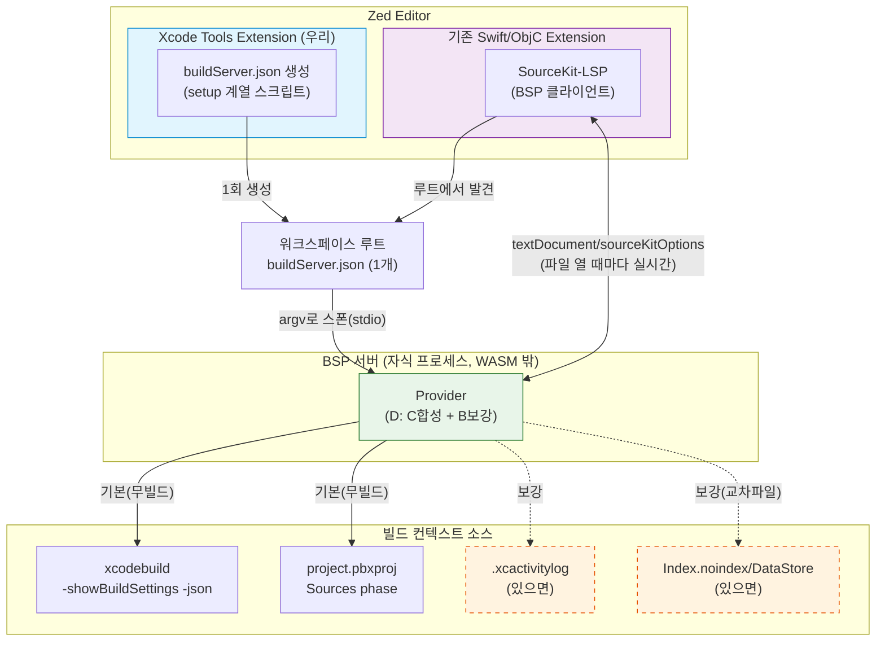
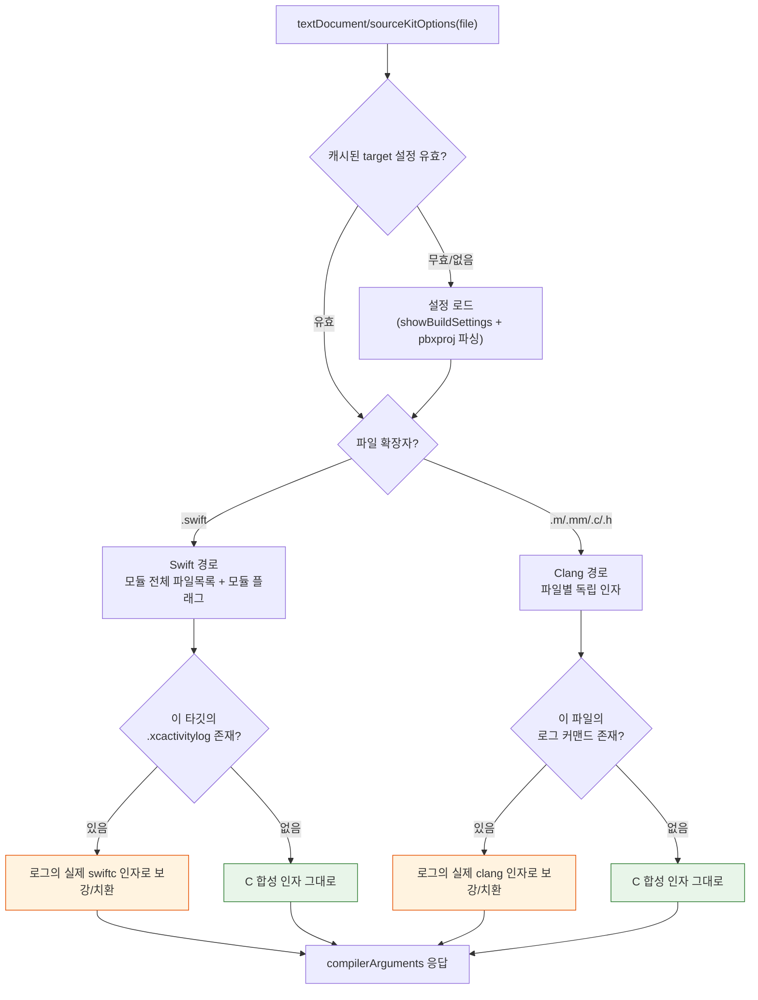
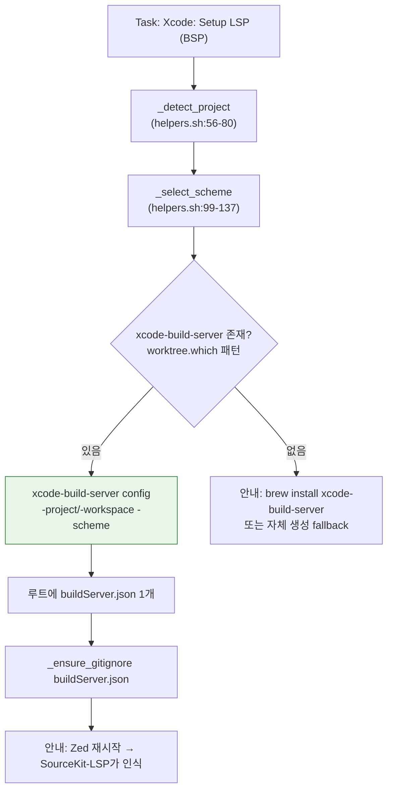
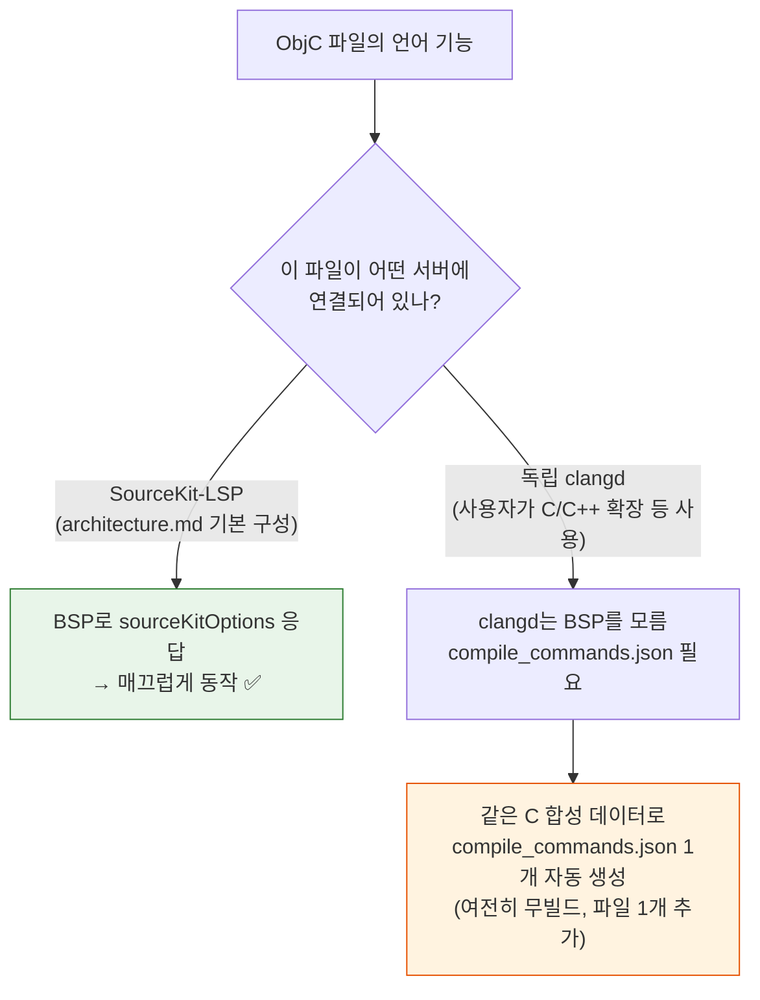

# 설계: 프로젝트 인식 (SourceKit-LSP 빌드 컨텍스트 공급) — 하이브리드 BSP 방식

> **상위 문서**: [PRD.md](../PRD.md) | [architecture.md](./architecture.md) | [v0.1_spec.md](./v0.1_spec.md)
> **상태**: 설계 (구현 전)
> **작성일**: 2026-07-13
> **대상 산출물(예정)**: `scripts/helpers.sh` (BSP 액션 추가), `scripts/setup.sh` 계열(buildServer.json 생성), 신규 provider 스크립트/바이너리(무빌드 합성)
> **전제 도구**: Xcode 26.6 (17F113), `xcode-build-server` 1.3.0(`/opt/homebrew/bin`), `sourcekit-lsp`(Xcode 툴체인 내장)

---

## 0. 이 문서를 읽는 다른 세션에게 (TL;DR)

- 이 확장(Xcode Tools for Zed)은 지금 **빌드/실행/테스트/클린(Task) + 디버그(DAP)**만 한다. 언어 기능(문법·자동완성·정의점프)은 제공하지 않고 기존 Swift/ObjC extension의 **SourceKit-LSP에 위임**한다([architecture.md §1](./architecture.md)).
- 빈틈: SourceKit-LSP가 Xcode 프로젝트(`.xcodeproj`/`.xcworkspace`)의 **파일별 컴파일 인자**를 몰라서, 자동완성·정의점프·`import` 해석이 부정확하거나 안 된다. 지금까지의 통상 해법인 `compile_commands.json`은 (1) 정확히 채우려면 매번 재빌드가 필요하고 (2) 프로젝트에 파일이 산재하는 두 불편이 있다.
- 이 기능이 채우는 것: SourceKit-LSP에 **빌드 컨텍스트를 공급**한다. LSP 엔진 자체는 계속 기존 extension이 담당(“충돌 없이 공존” 원칙 유지).
- 채택 방식: **D = B + C 하이브리드**.
  - **C(무빌드 합성, 기본)**: `xcodebuild -showBuildSettings -json` + `project.pbxproj`의 Sources phase만으로 파일별 컴파일 인자를 **빌드 산출물 0개**로 합성.
  - **B(보강, 있으면)**: 이미 존재하는 빌드 로그(`.xcactivitylog`)와 인덱스 스토어(`Index.noindex/DataStore`)를 재사용해 정확도/교차파일 기능을 올린다. **재빌드는 강요하지 않고 있는 것만 활용.**
- 디스크 흔적: 워크스페이스 루트에 **`buildServer.json` 딱 1개**(자동 `.gitignore`), 캐시는 트리 밖(`~/.config/zed/xcode-tools/`).
- **결정 확정(2026-07-13, Phase 2 스파이크 후 최종)**: provider = **C-네이티브 직행** — 자체 최소 BSP 서버를 **Rust**로 구현하고 buildServer.json의 `argv`가 이 바이너리를 가리킨다. B(`xcode-build-server` proxy)는 **채택하지 않음**(스파이크상 로그 없는 프로젝트에서 `sourceKitOptions`에 기여 못함). B의 잔여 가치인 인덱스 스토어 경로 광고만 흡수. 스킴 처리 = **워크스페이스 내 전(全) 타깃을 훑어두고 파일별로 그 파일이 속한 타깃 기준으로 라우팅**(스킴이 아니라 타깃 단위). 상세·근거는 [§11](#11-미해결-결정사항-open-questions).
- **구현 시작점 3줄**은 문서 맨 끝 [§13](#13-구현-시작점-요약)에 있다.

---

## 1. 개요 & 현재 상태 요약

### 1.1 이 확장이 지금 하는 일 / 안 하는 일

| 영역 | 담당 | 근거 |
|------|------|------|
| 빌드/실행/테스트/클린 | **이 확장** (Task → `scripts/helpers.sh` → `xcodebuild`/`simctl`) | `scripts/helpers.sh:300-647`, `scripts/setup.sh:84-219` |
| 디버그(브레이크포인트) | **이 확장** (DAP → lldb-dap) | `src/lib.rs:116-226` |
| 문법(Tree-sitter) | 기존 Swift/ObjC extension | [architecture.md §1](./architecture.md) |
| **언어 기능(LSP: 자동완성/정의점프/진단)** | 기존 extension의 **SourceKit-LSP** | [architecture.md:14-23](./architecture.md), [PRD.md:43-44](../PRD.md) |

즉 이 확장은 “Xcode 워크플로우 대체”에 집중하고 LSP는 위임한다. 그러나 **SourceKit-LSP에게 프로젝트 구조/컴파일 인자를 알려주는 주체가 없어서** 언어 기능이 반쪽이 된다. 이 기능이 그 “빌드 컨텍스트 공급” 역할을 맡는다.

### 1.2 이 기능이 채우는 빈틈

SourceKit-LSP는 “이 파일을 컴파일하려면 어떤 인자가 필요한가?”를 알아야 정확히 동작한다(헤더 서치패스, 프리프로세서 매크로, SDK, 모듈명, 다른 소스 파일 목록 등). SwiftPM 프로젝트는 `Package.swift`로 이걸 자동으로 알지만, **Xcode 프로젝트는 그 정보가 `.pbxproj` 안에 묻혀 있어** LSP가 직접 읽지 못한다. 그래서 외부에서 컴파일 인자를 공급해야 한다.

---

## 2. 용어집 (Glossary)

| 용어 | 뜻 |
|------|----|
| **SourceKit-LSP** | Apple 공식 LSP 서버. Xcode 내부 인덱싱/의미분석 엔진과 동일 계열. Swift는 SourceKit 엔진, C/ObjC/C++는 내부 임베디드 clangd로 처리. 이 맥에서는 `xcrun --find sourcekit-lsp` → `/Applications/Xcode.app/Contents/Developer/Toolchains/XcodeDefault.xctoolchain/usr/bin/sourcekit-lsp` (검증됨). |
| **BSP (Build Server Protocol)** | LSP와 유사한 JSON-RPC 규약. 빌드 시스템(“빌드 서버”)이 LSP에게 타깃/소스/컴파일 인자를 **요청-응답**으로 제공. SourceKit-LSP가 클라이언트. |
| **buildServer.json** | 워크스페이스 루트에 놓는 BSP 설정 파일 1개. SourceKit-LSP가 이걸 발견하면 그 안의 `argv`로 지정된 실행 파일을 **자식 프로세스(BSP 서버)로 직접 띄우고** stdio로 통신한다. **컴파일 플래그 자체는 여기 없다**(서버가 응답으로 준다). |
| **`textDocument/sourceKitOptions`** | SourceKit-LSP의 BSP 확장 요청. “이 파일의 컴파일러 인자 목록을 달라”는 실시간 질의. 응답이 곧 그 파일의 자동완성/진단 정확도를 결정. |
| **인덱스 스토어 (Index Store)** | `~/Library/Developer/Xcode/DerivedData/<Proj>-<hash>/Index.noindex/DataStore`. 컴파일러가 생성하는 심볼 인덱스(정의/참조/심볼DB). **교차 파일** 기능(전역 정의점프, 참조찾기, 워크스페이스 심볼)의 원천. 이 맥에서 PAEScreenProvider = 18MB로 존재(검증됨). |
| **`compile_commands.json`** | Clang 컴파일 데이터베이스. `[{file, command, directory}, ...]` 배열의 **정적 스냅샷**. clangd가 이해하는 포맷. SourceKit-LSP도 fallback으로 읽지만, 갱신하려면 재생성(사실상 재빌드)이 필요. |
| **`-showBuildSettings`** | `xcodebuild -showBuildSettings [-json]`. **빌드 없이** 해석된 모든 빌드 설정을 덤프. `-json`은 `[{action, buildSettings:{...}, target}]` 배열(검증됨). |
| **pbxproj Sources phase** | `project.pbxproj` 내 `PBXSourcesBuildPhase`. 각 타깃이 **실제로 컴파일하는 소스 파일 목록**. 무빌드 합성의 “파일 목록” 원천. |
| **`.xcactivitylog`** | Xcode/xcodebuild 빌드 시 남는 gzip 바이너리 로그. 실제 실행된 `swiftc`/`clang` 커맨드가 그대로 들어있음. `xcode-build-server parse`로 `compile_commands` 형태(`.compile`)로 추출 가능. |
| **`.xcactivitylog`의 취약성** | Xcode가 오래된 로그를 정리하거나, DerivedData만 남고 로그가 없을 수 있음. **검증**: PAEScreenProvider DerivedData는 인덱스 스토어(18M)는 있으나 `Logs/Build`에 `.xcactivitylog`가 없다(=`LogStoreManifest.plist`만). 다른 프로젝트(RCAPIHost 등)는 있다(전체 98개). |
| **`xcode-build-server`** | 오픈소스 BSP 서버(Python, 1.3.0). Xcode 프로젝트를 BSP로 노출. 데이터 소스는 **빌드 로그(`.xcactivitylog`)**. `config`로 buildServer.json 생성, `serve`로 서버 구동, `parse`로 로그→`.compile` 변환. |
| **DerivedData / build_root** | `~/Library/Developer/Xcode/DerivedData/<Proj>-<hash>`. 빌드 산출물·인덱스·로그가 모이는 곳. buildServer.json의 `build_root`가 여기를 가리킨다. |

---

## 3. 문제 정의 & 목표 / 비목표

### 3.1 문제 (사용자가 없애고 싶은 두 불편)

1. **재빌드 강제**: `compile_commands.json`을 정확히 채우려면 (거의) 매번 빌드해야 한다. 편집→저장할 때마다 LSP 정확도를 위해 빌드하는 건 비현실적.
2. **파일 산재**: `compile_commands.json`(+ 부속 파일)이 프로젝트 트리에 흩어져 커밋 오염/혼란을 만든다.

### 3.2 목표 (정량)

| # | 목표 | 측정 기준 |
|---|------|-----------|
| G1 | **무빌드로 언어 기능 동작** | DerivedData/빌드 로그가 **전혀 없는** 상태에서, 대상 파일에 대해 자동완성·정의점프(파일 내)·`import`/헤더 해석이 동작 |
| G2 | **디스크 흔적 최소화** | 프로젝트 트리에 생성되는 파일 = **`buildServer.json` 1개**(자동 `.gitignore`). 그 외 캐시는 트리 밖 |
| G3 | **stale 없음** | 소스 편집만으로는 컨텍스트 재조회 불필요. `.pbxproj`/`*.xcconfig`/`Package.resolved` 변경 시에만 갱신 |
| G4 | **기존 extension과 공존** | Swift/ObjC extension의 SourceKit-LSP를 그대로 쓰고 충돌 없음([PRD.md §3](../PRD.md)) |
| G5 | **ObjC + Swift 동시 지원** | `.swift`→swiftc 인자, `.m/.mm/.h/.c`→clang 인자를 확장자별로 정확히 공급 |

### 3.3 비목표

- 문법/LSP 엔진 자체를 이 확장이 제공하지 않음(SourceKit-LSP 위임 유지).
- Xcode 완전 대체 아님(SwiftUI Preview, Interface Builder, 프로비저닝 등 제외 — [PRD.md §3](../PRD.md)).
- SPM 전용 프로젝트 지원(별도 — SourceKit-LSP가 이미 처리).
- 빌드 정확도 100% 재현(그건 B/실제 빌드의 영역). C는 “빌드 없이 충분히 정확”이 목표.

---

## 4. 방식 비교 (A~F)와 D 선택 근거

| 방식 | 개요 | 무빌드? | 디스크 흔적 | stale | 공존 | 구현비용 | 판정 |
|------|------|:---:|------|:---:|:---:|:---:|------|
| **A. 현상 유지** | 빌드 후 `compile_commands.json` 수동 생성 | ✗ | 다수·산재 | 큼 | ○ | 0 | 문제 그대로 |
| **B. xcode-build-server + buildServer.json** | 검증된 BSP 서버가 **빌드 로그**를 파싱해 공급 | △(과거 빌드 필요) | 1개 | 작음 | ○ | 낮음 | 로그 없으면 반쪽(§2 취약성) |
| **C. 무빌드 합성** | `showBuildSettings`+`pbxproj`로 파일별 인자 **합성** | ✓ | 1개 | 없음 | ○ | 중간 | 정확도 실측 필요 |
| **D. B+C 하이브리드** | C를 기본, B(로그/인덱스)로 보강 | ✓ | 1개 | 없음 | ○ | 중간 | **채택** |
| **E. 완전 자체 BSP 서버** | 핸드셰이크 전부 신규 구현 | ✓ | 1개 | 없음 | ○ | **높음** | 최후 수단 |
| **F. LSP 자체를 확장이 관리** | SourceKit-LSP를 직접 스폰+옵션 주입 | ✓ | 1개 | 없음 | **✗** | 높음 | 기존 extension과 충돌, 원칙 위반 |

### 4.1 D 선택 근거

- **B의 강점(검증된 정확도) + C의 강점(무빌드)** 을 합친다. B는 이미 동작하는 도구(`xcode-build-server` 1.3.0)라 리스크가 낮고, C는 “빌드 로그가 없어도 되는” 유일한 축이다.
- **실증 근거**: PAEScreenProvider는 인덱스 스토어(18M)는 있으나 `.xcactivitylog`가 **없다**. B 단독이면 이 프로젝트는 “빌드 로그 없음 → 컴파일 인자 없음” 상태가 된다. C가 기본으로 있어야 이 케이스가 산다. 반대로 로그/인덱스가 있는 프로젝트(RCAPIHost 등, 로그 98개)에서는 B로 정확도를 끌어올린다.
- **E는 배제**: BSP 핸드셰이크(`build/initialize` → `build/initialized` → `workspace/buildTargets` → `buildTarget/sources` → `textDocument/sourceKitOptions` → `build/shutdown`)를 전부 다시 짜는 비용이 크다. C의 합성 로직만 필요하면, E 대신 **B를 베이스라인으로 두고 그 위에 C를 얹거나 얇은 provider로** 두는 편이 안전하다([§11](#11-미해결-결정사항-open-questions) Q1).
- **F는 배제**: PRD의 “기존 Swift/ObjC extension과 충돌 없이 공존” 원칙을 정면으로 위반한다.

---

## 5. 아키텍처

### 5.1 데이터 흐름 (전체)



### 5.2 컴포넌트 책임 분리

| 컴포넌트 | 책임 | 실행 위치 |
|----------|------|-----------|
| **이 확장 (WASM `src/lib.rs`)** | (직접적으로) BSP 서버를 돌리지 않음. WASM 샌드박스는 프로세스 스폰 불가([PRD.md §7](../PRD.md)). 역할은 두 가지로 축소: ① BSP 서버 바이너리 확보(경로 탐색), ② buildServer.json 생성 트리거. | WASM |
| **buildServer.json 생성 스크립트** | `xcode-build-server config` 또는 자체 생성으로 루트에 1개 작성. 프로젝트/스킴 탐지는 `helpers.sh` 함수 재사용. `.gitignore` 등록. | 셸(WASM 밖) |
| **BSP 서버(Provider)** | SourceKit-LSP가 **직접 스폰**. `sourceKitOptions` 질의에 응답. D 로직(C 합성 기본 + B 보강). | 자식 프로세스(WASM 밖) |
| **기존 SourceKit-LSP** | BSP 클라이언트로서 buildServer.json 발견→서버 스폰→파일별 인자 질의. 언어 기능 제공. | 기존 extension 소유 |

> **핵심**: BSP 서버는 WASM 샌드박스 안에서 돌 필요가 없다. SourceKit-LSP가 buildServer.json의 `argv`를 보고 그 실행 파일을 자기 자식으로 띄운다. lldb-dap을 우리가 직접 실행하지 않고 Zed가 실행하는 것([architecture.md §2 DAP 흐름](./architecture.md))과 같은 구조다.

### 5.3 이 확장 코드가 건드리는 범위

| 파일 | 변경 성격 | 근거/재사용 패턴 |
|------|-----------|------------------|
| `scripts/helpers.sh` | BSP 관련 액션 추가(`bsp-setup` 등) | 프로젝트 탐지 `_detect_project`(`helpers.sh:56-80`), 스킴 탐지 `_discover_schemes`(`helpers.sh:85-97`), 설정 캐싱 `_cache_build_settings`(`helpers.sh:172-183`) 재사용 |
| `scripts/setup.sh` 계열 | buildServer.json “1회 생성” | `~/.config/zed/xcode-tools/`에 파일 배치·설정 파일 1회 작성 패턴(`setup.sh:32-84`) 재사용 |
| 신규 provider(스크립트/바이너리) | 무빌드 합성(C) 로직 | 베이스라인은 `xcode-build-server`(B). C는 그 위에 얹거나 얇은 wrapper([§11 Q1](#11-미해결-결정사항-open-questions)) |
| `src/lib.rs` | (필요 시) BSP 서버 바이너리 경로 탐색 | `worktree.which()` fallback chain(`src/lib.rs:32-49`) 재사용 |

---

## 6. 하이브리드 해석 로직 (D)

### 6.1 `sourceKitOptions` 1건 처리 결정 흐름



원칙: **C(합성)가 항상 유효한 baseline을 만들고, B(로그)가 있으면 그것으로 덮어써 정확도를 올린다.** 교차 파일 기능(전역 정의점프/참조)은 인덱스 스토어(§6.5)가 있으면 자동으로 붙는다.

### 6.2 C: 무빌드 합성 — 공통 설정 해석

`xcodebuild -showBuildSettings -json -project <p> -scheme <s>` 출력에서 파일별 인자를 조립한다. **검증된 출력 구조**(PAEScreenProvider):

- 최상위: `[{ "action": ..., "buildSettings": {...}, "target": ... }]` 배열(타깃별 1개).
- 조립에 쓰는 핵심 키(검증된 실제 값 예시):

| 빌드 설정 키 | 검증된 값(발췌) | 합성 시 매핑 |
|--------------|------------------|--------------|
| `SDKROOT` | `.../MacOSX26.5.sdk` | clang/swiftc `-isysroot <SDKROOT>` |
| `SDK_NAMES` | `macosx26.5` | 타깃 트리플/플랫폼 판단 |
| `HEADER_SEARCH_PATHS` | 공백 구분 절대경로 다수 | clang `-I<each>` |
| `FRAMEWORK_SEARCH_PATHS` | `.../Build/Products/Debug ` | clang/swiftc `-F<each>` |
| `USER_HEADER_SEARCH_PATHS` | (없을 수 있음) | clang `-iquote<each>` |
| `GCC_PREPROCESSOR_DEFINITIONS` | `DEBUG=1 ` | clang `-D<each>` |
| `OTHER_CFLAGS` / `OTHER_SWIFT_FLAGS` | (없을 수 있음) | 그대로 append |
| `CLANG_ENABLE_MODULES` | `YES` | clang `-fmodules` |
| `CLANG_ENABLE_OBJC_ARC` | `YES`(스파이크 검증) | clang `-fobjc-arc` — **필수**. 없으면 weak property 파일 컴파일 실패(스파이크 2/8) |
| `CLANG_ENABLE_OBJC_WEAK` | `YES`(스파이크 검증) | ARC 동반 플래그 |
| `GCC_C_LANGUAGE_STANDARD` | `gnu17`(스파이크 검증) | clang `-std=gnu17` |
| `CLANG_CXX_LANGUAGE_STANDARD` | `gnu++20`(스파이크 검증) | clang++ `-std=gnu++20` (`.mm`) |
| `PRODUCT_MODULE_NAME` | `PAEScreenProvider` | swiftc `-module-name` |
| `SWIFT_VERSION` | (ObjC 프로젝트라 없음) | swiftc `-swift-version` |
| `SWIFT_OBJC_BRIDGING_HEADER` | (없음) | swiftc `-import-objc-header` |
| `MACOSX_DEPLOYMENT_TARGET` | `11.0` | `-target x86_64-apple-macos11.0` 등 |
| `IPHONEOS_DEPLOYMENT_TARGET` | `26.5` | iOS 타깃 시 트리플 |
| `BUILT_PRODUCTS_DIR` / `CONFIGURATION_BUILD_DIR` | DerivedData 경로 | 모듈맵/헤더 검색 |
| `DERIVED_FILE_DIR` | `.../DerivedSources` | 코드생성 소스 위치(§10) |

> 값들은 대개 **공백 구분 문자열**이라 파싱 시 분해 필요. **Phase 2 스파이크 확정**: `-json`도 다중값(`HEADER_SEARCH_PATHS`/`FRAMEWORK_SEARCH_PATHS` 등)은 배열이 아니라 **공백조인 단일 문자열**이며 quote를 하지 않는다. 파싱 규칙 = 공백 런 split → 빈 토큰 필터 → 순서보존 dedupe. 임베디드 공백 경로는 이 방식으로 복원 불가(실측 0/N, 문서화된 저위험 한계). 상세 [§11.3 Q4](#113-스파이크phase-2가-규명--사용자-결정-아님).

### 6.3 C: Swift — whole-module 파일 목록 처리

swiftc는 모듈을 **한 단위**로 컴파일하므로, 어떤 `.swift` 파일 하나의 `sourceKitOptions`도 **그 모듈의 전체 `.swift` 파일 목록**을 함께 넘겨야 정확하다(다른 파일의 심볼을 봐야 하기 때문).

- 파일 목록 원천: `project.pbxproj`의 대상 타깃 `PBXSourcesBuildPhase` → `.swift` 전부를 절대경로로 수집.
- 합성 인자(개념): `[공통 모듈 플래그] + [모듈의 전 .swift 파일 절대경로] + [-module-name <PRODUCT_MODULE_NAME>] + [-sdk <SDKROOT>] + [-target <triple>]`.
- **누락 리스크**: pbxproj에 없는 코드생성 파일(§10)이 빠지면 그 심볼 해석이 불완전 → B(로그) 보강 또는 `DERIVED_FILE_DIR` 스캔으로 완화.

> **Phase 3c 스파이크 확정(2026-07-13, RSDoctorRVMac 혼합 ObjC+Swift 34파일 → `swiftc -typecheck` 0에러)**. 로드베어링 인자:
> 1. 모듈의 전 `.swift` 절대경로 목록(pbxproj Sources phase) — 파일 하나 질의에도 전부 넘긴다.
> 2. `-module-name <PRODUCT_MODULE_NAME>`, `-sdk <SDKROOT>`, `-target <NATIVE_ARCH>-apple-<platform><deploy>`(PLATFORM_NAME으로 macos/ios 판단), `-swift-version <major>`(**`SWIFT_VERSION`의 `5.0`→`5`, `4.2`는 유지**).
> 3. `-import-objc-header <SWIFT_OBJC_BRIDGING_HEADER를 SRCROOT 기준 절대경로화>` — 혼합 타깃에서 "cannot find in scope" 대량 해소(80→3).
> 4. **소스트리 헤더 디렉토리 재귀 스캔을 각각 `-Xcc -I <dir>`로** — 브리징 헤더의 `#import` 해소(3→0). §6.4 ObjC 보강과 같은 dir 집합이나 전달을 **`-Xcc`(clang-importer)**로. `HEADER_SEARCH_PATHS`도 `-Xcc -I`.
> 5. `-module-cache-path <트리 밖>`(예 `~/.config/zed/xcode-tools/…`)로 PCH/모듈캐시가 프로젝트에 안 남게.
> 비로드베어링(있어도 무해): `-F FRAMEWORK_SEARCH_PATHS`, `-Xcc -D GCC_PREPROCESSOR_DEFINITIONS`, `SWIFT_ACTIVE_COMPILATION_CONDITIONS`→`-D<each>`(Swift define, `-Xcc` 아님), `OTHER_SWIFT_FLAGS`. 빌드 산출물/생성 `-Swift.h`는 **Swift typecheck엔 불필요**(엄격 무빌드 재실행으로 실증); 단 Swift API를 쓰는 ObjC 파일의 `#import "<Module>-Swift.h"`는 실빌드/B-로그만 공급(§10 E2, ObjC측). 빌드설정 다중값 파싱 규칙은 §11.3 Q4 동일.

### 6.4 C: ObjC/C — per-file 처리

clang은 파일마다 독립 컴파일하므로 파일별 인자만 있으면 된다.

- `.m/.mm/.c`: `[-isysroot SDKROOT] + [-I HEADER_SEARCH_PATHS...] + [-F FRAMEWORK_SEARCH_PATHS...] + [-D GCC_PREPROCESSOR_DEFINITIONS...] + [-fmodules(CLANG_ENABLE_MODULES=YES면)] + [-target <triple>] + [OTHER_CFLAGS]` + 파일 경로.
- `.h`(헤더): 컴파일 단위가 아니라 애매. 같은 디렉토리/타깃의 대표 `.m`의 인자를 상속(‑ `xcode-build-server`의 `XBS_FEAT_NEWFILE` 추론과 동일 발상). 브리징 헤더는 §8.

> **Phase 2 스파이크 보정(필수)**:
> 1. `-fobjc-arc`(`CLANG_ENABLE_OBJC_ARC=YES`)와 언어 표준(`-std=gnu17`/`-std=gnu++20`)을 반드시 포함. `-x objective-c`(또는 `objective-c++`)로 언어 명시.
> 2. **`HEADER_SEARCH_PATHS` 소스트리 헤더 디렉토리 재귀 스캔 보강**. 실제 프로젝트의 HSP 첫 항목은 `BUILT_PRODUCTS_DIR/<Config>/include`(빌드시 public header 복사본)라 무빌드 상태에선 존재하지 않는다. 소스 루트에서 `.h`가 있는 디렉토리를 스캔해 `-I`로 추가하면 이 갭이 메워진다(스파이크에서 5/8 → 8/8로 상승, §10 E1의 실제 발현).

### 6.5 B: 보강 (로그 + 인덱스)

- **빌드 로그(`.xcactivitylog`)**: DerivedData `Logs/Build/`에서 최신 로그를 찾아 실제 실행된 `swiftc`/`clang` 커맨드를 추출(개념적으로 `xcode-build-server parse` 결과 = `compile_commands` 형태). 파일이 매칭되면 C 합성 인자를 **로그 실제 인자로 치환**(가장 정확). 로그가 없으면(§2 PAEScreenProvider) 이 단계는 건너뛰고 C만 사용.
- **인덱스 스토어(`Index.noindex/DataStore`)**: SourceKit-LSP가 IndexStoreDB로 읽어 **전역 정의점프/참조찾기/워크스페이스 심볼**을 제공. BSP `build/initialize` 응답의 데이터로 인덱스 스토어 경로를 광고하면 SourceKit-LSP가 재빌드 없이 과거 인덱스를 활용. 존재 검증됨(PAEScreenProvider 18M).

### 6.6 캐시 & 무효화 전략

| 항목 | 정책 |
|------|------|
| 캐시 대상 | 타깃별 해석된 빌드 설정 + pbxproj 소스 목록(=`showBuildSettings` 호출 결과) |
| 캐시 위치 | 트리 밖: `~/.config/zed/xcode-tools/cache/<project-hash>/` (setup.sh의 `~/.config/zed/xcode-tools/` 관례 확장, `setup.sh:36`) |
| **무효화 트리거** | `project.pbxproj`, `*.xcconfig`, `Package.resolved`의 mtime/해시 변경 시에만 재조회 |
| **비트리거** | 일반 소스(`.swift`/`.m` 등) 편집 → 재조회 안 함(stale 없음의 핵심, G3). 파일 목록/플래그는 그대로 유효 |
| 신규 파일 | 캐시된 같은 디렉토리 파일 인자에서 추론(신규 파일 즉시 반영, 재조회 없이) |

---

## 7. buildServer.json 스펙 & 생성 절차

### 7.1 실제 필드 (검증된 생성 결과)

`xcode-build-server config -project PAEScreenProvider.xcodeproj -scheme PAEScreenProvider`가 실제로 생성한 파일:

```json
{
	"name": "xcode build server",
	"version": "1.3.0",
	"bspVersion": "2.2.0",
	"languages": ["c", "cpp", "objective-c", "objective-cpp", "swift"],
	"argv": ["/opt/homebrew/bin/xcode-build-server"],
	"workspace": "/Volumes/.../PAEScreenProvider.xcodeproj/project.xcworkspace",
	"build_root": "/Users/leegeonjoon/Library/Developer/Xcode/DerivedData/PAEScreenProvider-ckwewmeyqhnbubefvxhxqxaunpgg",
	"scheme": "PAEScreenProvider",
	"kind": "xcode"
}
```

| 필드 | 의미 | D에서의 처리 |
|------|------|--------------|
| `argv` | SourceKit-LSP가 스폰할 **BSP 서버 실행 커맨드** | B: `xcode-build-server` 경로. D: 자체 wrapper로 바꿀지 결정([§11 Q1](#11-미해결-결정사항-open-questions)) |
| `workspace` | 대상 `.xcworkspace`(단일 프로젝트도 내부 `project.xcworkspace`) | `_detect_project`(`helpers.sh:56-80`) 결과 사용 |
| `build_root` | DerivedData 루트. **인덱스 스토어/로그가 여기 밑** | B 보강의 진입점 |
| `scheme` | 스킴 | `_discover_schemes`/`_select_scheme`(`helpers.sh:85-137`) |
| `kind` | `xcode` 모드 | 고정 |
| `bspVersion`/`languages` | BSP 협상용 | 그대로 |

> **주의**: 이 파일에는 컴파일 플래그가 없다. `argv` 서버가 `build_root`(로그/인덱스)와 `workspace`를 보고 런타임에 플래그를 만든다. `config`가 성공하려면 프로젝트가 유효해야 하며(예: 경로가 사라진 워크트리는 `xcodebuild -showBuildSettings` 실패 → exit 66), 내부적으로 `xcodebuild -showBuildSettings -json`을 호출해 `build_root`를 찾는다(검증됨).

### 7.2 생성 command 설계 (helpers.sh/setup.sh 패턴 재사용)



- **재사용**: 프로젝트/스킴 탐지는 기존 함수 그대로. “1회 생성 후 재사용”은 `setup.sh`가 `helpers.sh`를 `~/.config/zed/xcode-tools/`에 1회 복사하고 `tasks.json`을 1회 쓰는 패턴(`setup.sh:47-219`)과 동형.
- **바이너리 확보**: `src/lib.rs:41-46`의 `worktree.which("xcrun")` → fallback 패턴을 그대로 차용해 `xcode-build-server`(또는 자체 wrapper) 경로를 찾는다. PATH는 `helpers.sh:50-51`처럼 `xcode-select -p`로 Xcode bin을 보강.
- **비대화식 스킴 선택**: 현재 `_select_scheme`은 다중 스킴 시 대화식 `read`(`helpers.sh:129`). BSP 생성은 1회성이므로 인자로 스킴을 받거나 “가장 최근 빌드 스킴”(`config`의 scheme 생략 동작)으로 처리 → [§11 Q3](#11-미해결-결정사항-open-questions).

### 7.3 `.gitignore` 처리 (G2)

- 루트 `buildServer.json`을 프로젝트 `.gitignore`에 자동 추가(중복 방지 검사 후 append).
- 참고: 이 확장 자체 저장소는 `.zed/`만 무시(`.gitignore:11-12`). 사용자 프로젝트의 `.gitignore`에 1줄 추가하는 것이므로 사용자 동의 여부는 [§11 Q6](#11-미해결-결정사항-open-questions).

---

## 8. ObjC / Swift 지원 및 clangd fallback 분기

SourceKit-LSP **하나**가 Swift(SourceKit)와 ObjC/C/C++(내부 임베디드 clangd)를 모두 담당한다. 빌드 설정/로그에는 swiftc용·clang용 플래그가 함께 들어있어 확장자별로 분기하면 된다(§6.3/§6.4). 혼합 타깃(브리징 헤더)도 같은 메커니즘: `SWIFT_OBJC_BRIDGING_HEADER`를 swiftc `-import-objc-header`로, ObjC 쪽은 그대로 clang 인자.

### 8.0 결정 확정(2026-07-13): ObjC를 sourcekit-lsp로 라우팅 (옵션 B)

**실측**: 실제 Zed ObjC 확장 **Akzestia/objcpp**는 `.m/.mm/.h`를 stock `clangd`(`--compile-commands-dir <워크스페이스 루트>`)로 붙인다. 이 clangd는 BSP도 sourcekit-lsp도 모르고 **디스크의 `compile_commands.json`만** 읽는다 → 우리 BSP가 ObjC에 **안 닿는다**. 반면 sourcekit-lsp는 buildServer.json을 발견해 `sourceKitOptions`로 받은 인자를 **내부 clangd에 주입**(`DidChangeConfigurationNotification(compilationDatabaseChanges:)`)하므로, ObjC가 sourcekit-lsp로 붙으면 BSP가 통한다.

**결정(옵션 B)**: **우리 확장이 Objective-C 언어(문법)+sourcekit-lsp 바인딩을 직접 제공**해 `.m/.mm/.h`를 sourcekit-lsp로 라우팅한다. 그러면 **BSP 하나로 Swift+ObjC를 모두 커버**한다(우리 BSP 서버는 이미 `.m/.h`에 clang 합성 인자를 반환 — §6.4/state·synth). 결과:
- **`compile_commands.json`/Phase 4 불필요** — §8.1의 clangd fallback은 "사용자가 굳이 독립 clangd를 쓸 때"의 대안으로만 남긴다.
- **Akzestia/objcpp 불필요** — 사용자는 우리 확장 + Swift 확장만 설치.
- 흔적 최소(G2)·stale 없음(G3) 목표에 부합(디스크에 buildServer.json 1개, ObjC 인자는 BSP로 동적 공급).

**트레이드오프**: (1) 우리 확장 범위가 "빌드 컨텍스트 공급"에서 **ObjC 언어 등록 + LSP 라우팅**까지 확장 — 단 자체 LSP 엔진을 만드는 게 아니라 **Apple sourcekit-lsp로 라우팅**(원칙의 정신 유지, F와 다름). (2) Akzestia clangd 부가기능(clang-tidy, iwyu 헤더삽입) 상실, 대신 sourcekit-lsp 인덱스 기반 전역 정의점프 획득. **구현 = Phase 3e**(§9).

### 8.1 (대안) clangd fallback 분기 — 사용자가 독립 clangd를 고수할 때만



- **전제**: ObjC가 **SourceKit-LSP로 연결되어야** BSP 경로가 매끄럽다. 기존 [architecture.md:20-23](./architecture.md)의 구성이 바로 이 경우(ObjC extension → SourceKit-LSP).
- **fallback 분기**: 만약 ObjC가 **독립 clangd**로 붙는 설정이면 clangd는 BSP를 못 알아듣고 `compile_commands.json`을 원한다. 이때는 §6의 **동일한 C 합성 데이터**로 `compile_commands.json`을 1개 자동 생성한다. 여전히 무빌드, 파일 1개 추가(루트, `.gitignore` 등록). G2를 유지(1개는 buildServer.json, clangd 케이스만 1개 더).
- 이 분기는 [§9 Phase 4](#9-단계별-구현-로드맵)에서 별도 구현.

---

## 9. 단계별 구현 로드맵

각 단계는 독립 검증 가능. 실증 대상: **PAEScreenProvider**(`/Volumes/SourceCode/NEWSDK/sdks/sdk_modules/paescreenprovider`, 순수 ObjC, 단일 타깃/스킴, Index 18M / 빌드로그 없음).

### Phase 1 — B 베이스라인 (즉시 검증)

- **작업**: `xcode-build-server config`로 루트에 buildServer.json 생성 → SourceKit-LSP 인식 확인. 인덱스 스토어 재사용(전역 정의점프). 빌드 로그가 없으면 `helpers.sh build`(기존 Task, `helpers.sh:300-379`) 1회 실행으로 로그 생성.
- **수용 기준(AC)**:
  - AC1: 루트에 buildServer.json 1개 생성, `.gitignore` 등록.
  - AC2: (로그 있는 프로젝트) SourceKit-LSP가 파일 열 때 진단/자동완성이 프로젝트 심볼을 인식.
  - AC3: 인덱스 스토어 기반 전역 정의점프/참조찾기 동작.
- **검증 방법**: Zed에서 PAEScreenProvider 열기 → `.m` 파일에서 프로젝트 헤더 심볼 자동완성/정의점프. 로그 없을 때(현재 상태)와 `helpers.sh build` 1회 후를 비교.

### Phase 2 — C 무빌드 합성 스파이크 (정확도 실측)

- **작업**: `showBuildSettings -json` + pbxproj Sources phase 파싱 → 파일별 clang/swiftc 인자 합성기 프로토타입. B와 결과 비교.
- **수용 기준**:
  - AC1: **DerivedData 전체 삭제**(로그·인덱스 없음) 상태에서, 대상 `.m`/`.swift` 파일의 자동완성·파일 내 정의점프·`#import`/`import` 해석이 동작.
  - AC2: 합성 인자 vs 로그 실제 인자의 diff를 정량화(핵심 플래그 커버리지 %).
- **검증 방법**: PAEScreenProvider에서 `rm -rf DerivedData/PAEScreenProvider-*` 후 열어서 언어 기능 확인. 합성 인자를 손으로 `clang -fsyntax-only`에 먹여 파싱 성공 여부로 1차 검증.
- **결과(2026-07-13, 비파괴 스파이크)**: `rm -rf DerivedData` 대신 로그/인덱스를 **읽지 않는 것으로 무빌드를 시뮬레이션**(인덱스 18M 보존). 대표 8소스 `clang -fsyntax-only` **8/8 clean(에러 0)**. AC2 diff(로그 실제 인자 대비)는 대상에 로그가 없어 이번 스파이크 범위 밖(로그 있는 프로젝트에서 별도 측정). §6.2/§6.4/§11.3에 결과 역주입 완료. **판정: C GO.**

### Phase 3 — D 통합

- **작업**: §6.1 결정 흐름 구현(C 기본 + B 보강), §6.6 캐시/무효화, buildServer.json `argv`를 최종 provider로 확정(**B proxy → 안 되면 C**, [§11.1](#11-미해결-결정사항-open-questions) 확정).
- **수용 기준**:
  - AC1: 로그 유무와 무관하게 언어 기능 동작(로그 있으면 정확도↑).
  - AC2: 소스 편집만으로는 재조회 없음; pbxproj 변경 시 자동 갱신.
  - AC3: 흔적 = buildServer.json 1개 + 트리 밖 캐시.
- **검증 방법**: 파일 편집→자동완성 지연 관찰(재조회 없음 확인), pbxproj에 파일 추가→반영 확인.

### Phase 4 — clangd fallback

- **작업**: ObjC가 독립 clangd로 붙는 환경 감지 → 동일 C 데이터로 `compile_commands.json` 1개 생성.
- **수용 기준**: clangd 환경에서 ObjC 자동완성/정의점프 동작, 무빌드 유지.
- **검증 방법**: clangd 기반 설정에서 PAEScreenProvider `.m` 확인.

---

### 9.5 구현 현황 (2026-07-13)

- **✅ 완료**: BSP 서버(Rust `bsp-server`, C-네이티브 · WASM 밖 네이티브 바이너리 `xcode-bsp`), C 무빌드 합성(ObjC clang per-file + Swift whole-module), 인덱스 스토어 광고, `bsp-setup`의 buildServer.json 생성(우리 바이너리 argv), `setup.sh` 빌드/설치 부트스트랩, **우리 확장의 ObjC 언어 등록 + sourcekit-lsp 라우팅(Phase 3e, §8.0 옵션 B)**, **다중 프로젝트/타깃 파일별 라우팅(Phase 3b-1)**.
- **실증(전부 무빌드·비오염)**: PAEScreenProvider(순수 ObjC) 8/8 `clang -fsyntax-only` clean; RSDoctorRVMac(혼합, Swift) 34파일 `swiftc -typecheck` clean; RVmacRXViewerProjects(3프로젝트/9타깃 워크스페이스) 파일→타깃 라우팅 + Display clang clean + 인덱스 광고.
- **핵심 불변식(회귀 금지)**: per-file 인클루드는 **타깃별로 스코프**한다 — 그 타깃의 소스가 있는 프로젝트 dir + 공유 `common/`만, 형제 프로젝트·`Build/`·`DerivedData/` 제외. **워크스페이스 전체 `-I` 스캔은 헤더 basename 충돌로 "duplicate interface" 에러를 유발하므로 금지.**
- **라우팅**: 파일→타깃 멀티맵(단일 소속은 경로, 공유 `common/`은 결정적 primary). 타깃 설정은 lazy 로딩+캐시. 워크스페이스는 프로젝트-한정 스킴 로딩(`settings_belong_to` 가드로 동명 스킴 오로드 차단). 단일 `.xcodeproj`는 동일 코드 경로의 1-프로젝트 워크스페이스로 처리(명시 `-s` 존중).
- **✅ 추가 해결(2026-07-14)**: (1) **캐시 무효화(3b-2)** — `.pbxproj`/`*.xcconfig`/`Package.resolved` mtime 감시: 질의 시점 재열거(재시작 불필요) + 백그라운드 감시 스레드가 변경 시 `buildTarget/didChange{changes:null}` 전송(열린 파일까지 재질의). 락 규율(두 뮤텍스 동시 보유 금지)·panic 격리·bounded plutil로 데드락/freeze 없음. (2) **중첩 `Group` 워크스페이스** — 스택 기반 파서로 nesting 해석(group:/container:/self:/absolute:). (3) **다중 프로젝트 인덱스** — 워크스페이스 공용 DerivedData 인덱스를 광고(정상 케이스 전 프로젝트 커버), 부재 시 이름 기반 파일 스캔 폴백.
- **잔존 한계(설계상 불가피)**: BSP `indexStorePath`가 단수라 "공용 인덱스 없이 프로젝트별로만 빌드된" 워크스페이스는 1개 스토어만 광고(SourceKit-LSP 프로토콜 제약); 커스텀 `-derivedDataPath` + 미빌드 primary는 인덱스 폴백 실패; Phase 4 clangd fallback은 옵션 B(ObjC→sourcekit-lsp 라우팅) 채택으로 불필요; 무빌드 잔여(코드생성 소스·`BUILT_PRODUCTS_DIR/include` public header·`-Swift.h`)는 §10 E1/E2대로 실빌드/B-로그만 공급.

---

## 10. 엣지케이스 & 리스크

| # | 케이스/리스크 | 영향 | 완화책 |
|---|----------------|------|--------|
| E1 | **코드생성 소스** (Core Data, R.swift, protobuf, 빌드페이즈 스크립트) — pbxproj에 실물 없음 | Swift whole-module 파일 누락 → 심볼 미해석 | `DERIVED_FILE_DIR`/`BUILT_PRODUCTS_DIR` 스캔 포함, **B 로그 보강**(로그엔 생성 파일 경로 포함) |
| E2 | **혼합 ObjC/Swift 브리징** | 브리징 헤더 미반영 시 상호 심볼 안 보임 | `SWIFT_OBJC_BRIDGING_HEADER`→`-import-objc-header`, 생성된 `-Swift.h`는 `DERIVED_FILE_DIR`에서 탐색 |
| E3 | **whole-module 파일 누락** | 일부 심볼 미해석 | pbxproj 전량 수집 + B 보강; 누락 시 그 파일만 부정확(치명적 아님) |
| E4 | **워크스페이스 vs 단일 프로젝트** | `-workspace` vs `-project` 플래그 상이 | `_detect_project`(`helpers.sh:56-80`) 재사용(이미 workspace 우선) |
| E5 | **다중 스킴/다중 타깃** | 어느 스킴/타깃으로 생성? | 비대화식 스킴 지정 or “최근 빌드 스킴”. 타깃별 설정은 pbxproj 파일→타깃 매핑으로 라우팅([§11 Q3](#11-미해결-결정사항-open-questions)) |
| E6 | **SPM 혼합** (Xcode + SPM 패키지) | 패키지 소스는 SourceKit-LSP가 자체 처리, Xcode 타깃만 우리 담당 | `Package.resolved` 변경을 무효화 트리거로; 경계 파일은 B 보강 |
| E7 | **로그 부재/오래됨** (검증: PAEScreenProvider) | B 단독이면 반쪽 | **C가 기본**이라 무빌드로 동작(D 설계의 핵심 이유) |
| E8 | **`showBuildSettings` 경로 공백** | 파싱 깨짐 | quote 규칙 실측 후 파서 방어([§11 Q4](#11-미해결-결정사항-open-questions)) |
| E9 | **`config` 실패**(프로젝트 경로 무효 등, exit 66) | buildServer.json 생성 실패 | 에러 메시지로 원인 안내(스킴/프로젝트 확인), 자체 생성 fallback |
| E10 | **WASM 제약** | 파서/서버를 WASM 안에서 못 돌림 | provider는 WASM 밖 프로세스(SourceKit-LSP가 스폰). 파싱은 셸/외부 바이너리 |

---

## 11. 미해결 결정사항 (Open Questions)

> **2026-07-13 사용자 결정 반영.** Q1·Q3은 확정, Q2·Q5·Q6·Q7은 권장 기본값으로 확정. Q4는 사용자 결정이 아니라 스파이크(Phase 2)가 규명한다.

### 11.1 결정됨 (확정)

- **Q1 (provider 형태) — 결정 확정(2026-07-13, 최종): C-네이티브 직행.** B proxy는 채택하지 않는다.
  - buildServer.json의 `argv`는 **자체 C-네이티브 BSP 서버(우리 provider)**를 가리킨다. provider가 BSP 핸드셰이크(`build/initialize` → `workspace/buildTargets` → `buildTarget/sources` → `textDocument/sourceKitOptions` → `build/shutdown`)를 직접 처리하고, per-file 인자는 C 합성으로 응답한다.
  - B(`xcode-build-server`)의 잔여 가치인 **인덱스 스토어 경로 광고**만 `build/initialize` 응답에 흡수한다(교차파일 점프/참조). B proxy 중계 계층은 두지 않는다.
  - 근거(스파이크 실증): "인덱스는 있고 로그는 없는" 프로젝트(PAEScreenProvider)에서 `xcode-build-server`는 파싱할 `.xcactivitylog`가 없어 `sourceKitOptions`에 **기여하지 못한다**. 반면 C 합성은 빌드 0회로 8/8 clean 파싱 달성. B proxy를 거칠 실익이 없어 §4.1의 **E(자체 BSP 서버)와 동일 지점으로 확정 수렴**.
  - **부트스트랩(신규 필수 — Codex 검토 반영)**: provider가 자체 바이너리이므로, buildServer.json의 `argv`가 **그 바이너리 경로**를 가리키도록 생성해야 한다(§7 갱신 대상). Phase 1의 `xcode-build-server config` 기반 buildServer.json은 **베이스라인/과도기**이며, Phase 3a에서 우리 provider를 가리키도록 교체된다. `xcode-build-server` 런타임 의존은 provider 완성 시 제거된다.

- **Q3 (스킴/타깃 커버리지 & 라우팅) — 결정: 전(全) 타깃 훑기 + 파일별 타깃 라우팅.**
  - provider는 워크스페이스(= Zed가 연 루트) 안 **모든 타깃**의 빌드 설정/소스 목록을 훑어 캐시한다("모든 스킴" 커버리지).
  - `sourceKitOptions(file)` 질의는 **그 파일이 속한 타깃**을 pbxproj 매핑으로 찾아 그 타깃 기준으로 응답한다("파일이 속한 프로젝트의 스킴" 라우팅).
  - 라우팅 단위는 **스킴이 아니라 타깃**이다. 스킴은 `build_root`(DerivedData)·configuration 선택 용도로만 쓴다. 다중 스킴이면 앱 스킴 우선, 필요 시 최초 1회 확인 후 기억.
  - 정합성: 이 "전 타깃 커버리지"는 C(합성) 계층에서 성립한다. 순수 B(`xcode-build-server`)는 buildServer.json에 스킴 1개만 담는 모델(§7.1)이라 전 타깃 동시 커버가 어색 → Q1의 "결국 C" 지향과 맞물린다.

### 11.2 권장 기본값으로 확정 (사용자 이견 시 재검토)

- **Q2 (배포 형태) — 결정 확정(2026-07-13): Rust 네이티브 바이너리.** provider는 프로세스형이고 pbxproj/JSON-RPC 파싱이 셸로는 취약하므로 바이너리. 언어는 이 확장(`src/lib.rs`)과 동일한 **Rust**로 확정(단일 툴체인, 타입 안전). 단 WASM 밖 독립 네이티브 바이너리라 **빌드/설치 부트스트랩을 신규 마련해야 함**(Phase 3a, Codex 검토 반영). WASM은 후보 아님(§10 E10).
- **Q5 (buildServer.json 위치) — 기본값: Zed가 연 워크스페이스 루트에 1개.** 다중 프로젝트는 provider가 전 타깃을 훑어 처리(Q3와 동일 메커니즘)하므로 파일은 여전히 1개.
- **Q6 (.gitignore) — 기본값: 자동 추가(중복 검사 후 append) + 최초 1회 고지.**
- **Q7 (설치 안내) — 기본값: 미설치 시 `brew install xcode-build-server` 안내만(자동 설치 안 함).** 최종적으로 C 자체 provider로 수렴하면 이 의존성은 제거 가능.

### 11.3 스파이크(Phase 2)가 규명 — 사용자 결정 아님

- **Q4 (`showBuildSettings` 공백/quote 규칙) — 규명 완료(Phase 2)**: `-json`이든 plain이든 다중값 설정은 **공백조인 단일 문자열**로 나오고 quote가 없다. 파서 = 최상위 구조는 `-json`으로 잡고(타깃/action/buildSettings 분리·이스케이프 안전), 각 다중값은 **공백 런으로 split → 빈 토큰 제거 → 순서보존 dedupe**. HSP는 실측에서 중복(23→12)·이중 공백·후행 공백이 있었고, 임베디드 공백 경로는 0/N. 임베디드 공백은 `showBuildSettings`만으로는 복원 불가(문서화된 저위험 한계, 필요 시 `.pbxproj`/`.xcconfig` 원본 대조).
- **C 합성 정확도 — 규명 완료(Phase 2)**: PAEScreenProvider(순수 ObjC, 8소스)에서 빌드 0회로 `clang -fsyntax-only` **8/8 clean**. 단, 다음 두 보정이 필수임을 실측: (a) `-fobjc-arc` + 언어 표준 키(§6.2 갱신), (b) HSP를 소스트리 헤더 디렉토리 스캔으로 보강(§6.4 갱신). pbxproj 파싱은 `plutil -convert json` + PBXGroup 부모체인 역추적(objectVersion 77 OpenStep plist).
- **B 중계 가능성 · BSP 실제 필드**: Phase 3에서 실제 provider 구현 시 확정(스파이크는 C 합성 축을 우선 검증). Q1 재조정(§11.1) 참조.

---

## 12. 참고자료

- xcode-build-server (BSP 서버): https://github.com/SolaWing/xcode-build-server
- Build Server Protocol 스펙: https://build-server-protocol.github.io/
- SourceKit-LSP (Apple/swiftlang): https://github.com/swiftlang/sourcekit-lsp
- SourceKit-LSP BSP 확장(`textDocument/sourceKitOptions` 등): sourcekit-lsp 저장소 `Contributor Documentation/BSP Extensions`
- 로컬 근거: `docs/architecture.md`(공존 구조), `scripts/helpers.sh`(프로젝트/스킴/설정 함수), `scripts/setup.sh`(1회 생성 패턴), `src/lib.rs`(worktree.which fallback)

---

## 13. 구현 시작점 요약

1. **Phase 1 즉시 착수**: `helpers.sh`에 BSP 액션 추가 — `_detect_project`/`_select_scheme`로 프로젝트·스킴을 잡아 `xcode-build-server config`를 호출해 루트에 `buildServer.json` 1개 생성 + `.gitignore` 등록. (재사용: `helpers.sh:56-137`, 패턴: `setup.sh:47-219`)
2. **바이너리 확보는 lldb-dap 방식 그대로**: `src/lib.rs:41-46`의 `worktree.which()` fallback로 `xcode-build-server`(또는 wrapper) 경로 탐색, PATH는 `xcode-select -p` 보강(`helpers.sh:50-51`).
3. **C 합성 스파이크로 정확도 실측**: `xcodebuild -showBuildSettings -json` + `project.pbxproj` Sources phase → 파일별 clang/swiftc 인자 합성. **DerivedData 삭제 후 PAEScreenProvider**에서 무빌드 자동완성/정의점프가 되는지로 판정(로그 없어도 동작 = D의 존재 이유).
